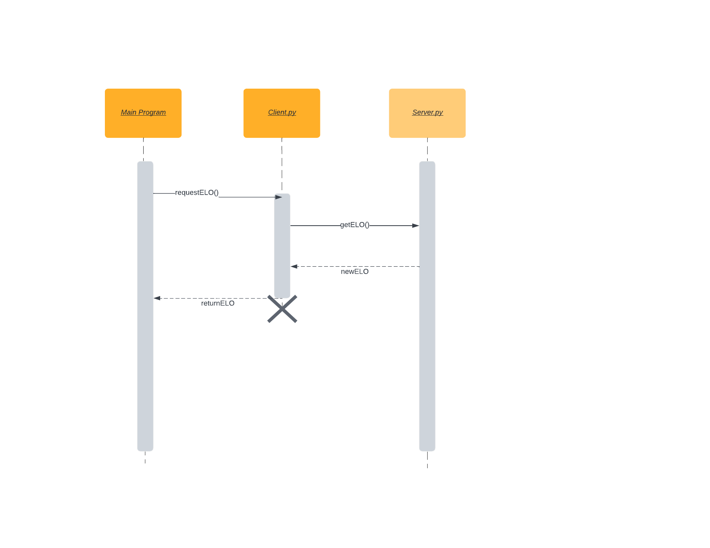

<h1>ELO Microservice Instructions:</h1>

  Imports:
  
    from client import get_elo, DISCONNECT_MESSAGE
    
    
  The server.py app must be running first to start the server listening. A request is made from the client by calling the get_elo function. The call is made twice, first with the data and second with a disconnect message.
  The server will then calculate the new elo rating and send the data back.
  
  
  Example call:
  
    get_elo(x) # where x is ['Frank', .5, 1000, 1200] or [user name/id, game outcome, users elo, opponent elo]
    get_elo(DISCONNECT_MESSAGE) # this stops the server from listening
  
  The first get_elo will return [username/id, new_elo] so it can be set to a variable to save the returned results.
      

